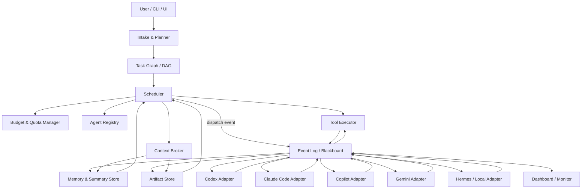
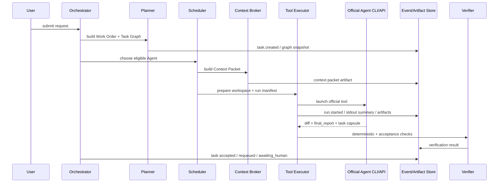
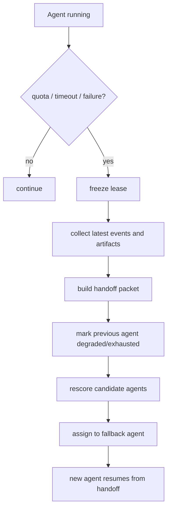

# 多大模型智能体协作工作流工具设计草案

> 目标：让 Codex、Claude Code、Copilot、Gemini、Hermes、本地模型等不同智能体在同一个工作流中协作，做到可派发、可观察、可转派、可控成本，并尽量减少重复上下文和 token 浪费。

## 1. 核心思路

不要把多个 Agent 做成一个“群聊”。群聊会导致上下文迅速膨胀、职责模糊、重复阅读同一份材料。

更稳的形态是：

- **Orchestrator 作为调度中枢**：负责任务拆分、派发、预算、状态流转、失败转派。
- **Agent 作为有能力画像的执行单元**：每个 Agent 通过统一适配器接入，暴露能力、成本、额度、上下文窗口、工具权限和当前状态。
- **Blackboard/Event Log 作为共享协作层**：Agent 不直接长篇对话，而是向共享事件流发布结构化状态、产物、阻塞点和交接包。
- **Artifact Store 作为事实来源**：代码 diff、设计文档、测试报告、日志、任务摘要都作为可引用产物保存，后续 Agent 只拿引用和摘要。
- **Budget Manager 作为一等公民**：每个任务都有 token/call/时间/金额预算，调度器必须按预算做选择。

一句话：**用“结构化任务 + 共享状态 + 可引用产物”代替“多个模型互相聊天”。**

## 2. 推荐架构



派发本身也以事件形式经过 Event Log，而不是 Scheduler 直接调用 Adapter。这样整个系统是 event-sourced 的：可以重放、可以在另一台机器上恢复、可以审计每一次派发的决策。

### 控制平面

- **Intake & Planner**：接收用户需求，生成总任务说明、验收标准、风险点和初始任务图。
- **Task Graph / DAG**：把需求拆成可并行、可依赖、可审核的小任务。
- **Scheduler**：根据能力、成本、额度、延迟和当前负载选择 Agent。
- **Budget & Quota Manager**：跟踪每个 Agent 的 token、调用次数、订阅额度、失败率、冷却时间。
- **Context Broker**：为每个任务生成最小必要上下文，控制上下文预算、缓存、敏感信息过滤和按需展开。
- **Tool Executor**：统一执行文件修改、命令、测试、网络访问等工具动作。Agent 提议动作，Executor 负责权限检查、执行和审计。
- **Policy Engine**：控制哪些任务能给云端模型，哪些只能给本地模型；哪些文件可读写；哪些操作需要人工确认。

### 数据平面

- **Event Log / Blackboard**：所有任务状态、心跳、提问、阻塞、结果、转派都写入事件流。
- **Artifact Store**：保存任务 brief、补丁、测试报告、截图、设计稿、总结、交接包。
- **Memory & Summary Store**：保存压缩后的项目记忆、Agent 历史表现、常见任务模板。
- **Workspace Connector**：连接 Git 仓库、文件系统、issue 系统、CI、浏览器、终端等工具。

### 组件时序图

为了避免 Orchestrator、Scheduler、Context Broker、Tool Executor 职责漂移，建议把一次标准任务执行固化成时序：



组件边界：

- **Orchestrator** 管整体状态和策略，不直接拼上下文、不直接跑 CLI。
- **Scheduler** 只做派发决策，不执行任务。
- **Context Broker** 只负责上下文选择、脱敏和缓存，不决定谁执行。
- **Tool Executor** 负责外层执行环境和进程生命周期，不负责模型判断。
- **Verifier / Reviewer** 负责验证和审查，不负责调度。

### 项目边界和分区

系统不要维护一张无边界的全局任务大图。建议所有核心实体都带 `project_id` / `workspace_id`：

- 一个 `project_id` 对应一个仓库、产品工作区或团队项目。
- Task Graph、Agent Registry 可按 project 分区，避免全局锁。
- Event Log 和 Artifact Store 按 project + 时间分区，方便归档和权限控制。
- Scheduler 可以多实例部署，但同一个 task 的 owner run 通过数据库租约或事件幂等键保证只有一个。

分布式调度时的底线：

- `run_id` 和 `task.edge_selected` 必须幂等。
- 同一 task 的 `current_owner_run_id` 用条件更新或 advisory lock 抢占。
- Agent Registry 的能力快照以 Event Log / DB 为事实来源，不依赖每个 Orchestrator 实例的内存缓存。

多项目部署时还需要硬隔离：

- 数据访问层强制每个查询带 `project_id`，不要只靠上层 UI 过滤。
- Agent run 只能读取本项目的 artifact、credential profile、workspace 和 task capsule。
- `artifact://`、`secret://`、`worktree://` 引用解析时必须校验 project 归属。
- 跨项目复用 Agent profile 可以，但 credential、cache、workspace、memory 必须按 project 隔离。
- 审计日志记录 project_id，支持按项目导出和删除。

## 2.1 执行边界：外层编排优先，内层工具可选受控

“Agent 与工具执行分离”容易被误读成：所有 Agent 内部的 Read/Edit/Bash 都必须先经过我们的 Tool Executor。对 `official_cli` / `official_extension` 这类黑盒工具来说，这既不现实，也会把系统推向脆弱的请求拦截。

更准确的模型是两层执行边界：

```text
外层执行边界（默认必须有）
  Orchestrator / Tool Executor:
    - 创建隔离 workspace
    - 写入 Work Order / Context Packet / .agent-workflow/
    - 注入受控环境变量和凭据引用
    - 启动、监控、取消、清理官方 Agent 进程
    - 收集 diff、stdout/stderr 摘要、artifact、usage
    - 运行统一 verification / review / handoff gate

内层工具边界（有正式扩展点时才接入）
  Agent proposes tool action
    -> Policy Engine checks policy
    -> Tool Executor runs controlled helper
    -> Event Log records result
    -> Agent receives structured tool result
```

这样做既保留了官方 CLI 自己的能力，又把系统真正需要控制的东西抓在外层：工作区、预算、凭据、网络、验证、产物和审计。

落地原则：

- 默认不接管 Agent 内部每一次文件读写和命令执行。
- 有 MCP、hook、插件、官方 JSON tool event 等正式扩展点时，再进入内层工具调用链。
- 高风险动作如果无法在内层拦截，就必须通过外层沙箱、文件系统权限、网络白名单和最终验证来兜底。
- 对外宣称的能力应区分清楚：`outer_supervised=true` 不等于 `inner_tool_control=true`。

### 2.1.1 集成原则：编排外部工具，而不是拦截外部工具

这里需要一个很重要的边界：**不要把 Codex CLI、Claude Code、Gemini CLI、Copilot 等现有 Agent 工具的内部请求截断后重包装**。更稳妥的第一原则是把它们作为“官方工具进程 / 官方 API / 官方扩展能力”纳入工作流，由 Orchestrator 拉起、监督、收集产物，而不是做网络层或协议层的 MITM。

推荐优先级：

1. **官方 CLI / API Adapter**：例如为某个任务创建独立 worktree，生成 brief 文件，然后拉起 `codex`、`claude`、`gemini` 等官方 CLI 执行任务，收集 stdout、退出码、diff、测试报告和产物目录。
2. **官方扩展点 Adapter**：如果工具提供 MCP、插件、hook、JSON 输出、session export、plan mode、headless mode 等正式接口，就通过这些接口接入。
3. **UI / IDE Automation Adapter**：对于没有稳定 CLI/API 的工具，可以通过 IDE 扩展、浏览器自动化或人机协作面板派发任务，但仍不假装自己是它的内部服务端。
4. **受控 Proxy / 拦截**：只作为企业内网审计、成本统计或兼容老工具的可选高级模式，必须显式开启、可关闭、可审计，并且不能作为系统正确性的基础。

这样设计的原因：

- 官方工具会频繁升级，拦截内部协议非常脆弱。
- 请求拦截可能违反工具预期、账号策略或用户信任边界。
- 多数工程价值来自任务编排、上下文包、worktree 隔离、产物收集、验收和转派，不需要碰内部请求链路。
- 把 Agent 当黑盒 worker 更容易替换和扩展：今天是 Codex CLI，明天可以是 Claude Code、本地 Hermes、团队自研 Agent。

在这种模式下，Tool Executor 不一定代理 Agent 内部的每一次 tool_use。它主要负责两类动作：

- **系统级动作**：准备 worktree、写入任务 brief、设置环境变量、启动/停止 Agent 进程、运行统一验证命令、收集 patch 和 artifacts。
- **受控辅助动作**：当某个 Agent 通过正式协议请求外部工具时，Executor 再按策略执行并记录结果。

也就是说，默认路径是：

```text
Orchestrator
  -> prepare isolated workspace
  -> write Work Order + Context Packet
  -> launch official Agent tool
  -> monitor process / heartbeat / artifacts
  -> run verification and review gates
  -> collect diff + handoff + usage
```

而不是：

```text
Agent internal API request
  -> intercepted by our proxy
  -> rewritten into our private protocol
```

#### 2.1.1.1 不拦截之后，怎么观察 Agent 的内部进度？

放弃拦截的代价是：Agent 在它自己的进程里跑 tool_use 循环，Orchestrator 看不到中间步骤，只能等最终产物。这正是反对拦截后真正要解决的问题。答案是用结构化观察代替拦截，按优先级：

1. **通过 MCP 提供我们自己的工具**（首选）。给 Agent 启动一个我们运营的 MCP server，暴露 `submit_progress`、`request_more_context`、`record_acceptance_evidence`、`flag_risk` 这类工具。Agent 自愿调用——不是替换它原有的 Read/Edit/Bash，而是**追加**我们关心的协作动作。Agent 没调用我们的工具不影响它运行；调用了，Orchestrator 就拿到结构化进度。这是 official_extension 模式下最干净的双向通道。
2. **解析官方结构化事件流**。Codex / Claude Code / Gemini CLI 多数都有 JSON event mode、session export、headless mode。优先消费这些正式产物，写进 Event Log。
3. **静默观察文件系统状态**。worktree 的 `git status`、未提交 diff、artifact 目录 mtime、测试输出文件——这些都是不依赖 Agent 主动汇报的客观信号，Adapter 可以做后台采样。
4. **stdout/stderr 启发式解析**。最不稳定的一档，仅作兜底。把 stdout 切成行级事件、按工具家族识别已知模式（"running tests"、"applying patch"、"context window 80%"），但不要把启发式当作正确性来源。

这四条加起来，Orchestrator 不需要拦截就能拿到足够进度信号——同时 Agent 那一侧的"我自己跑 tool_use 循环"模型完全保留，没有被破坏。

#### 2.1.1.1.1 任务胶囊目录：非拦截模式下的文件系统契约

不拦截内部请求后，需要一个稳定的外部协作契约。建议每个任务 workspace 里放一个 `.agent-workflow/` 任务胶囊目录，让所有官方 CLI Agent 都能用最普通的文件读写参与工作流：

```text
.agent-workflow/
  work_order.md              # 人类可读任务说明
  context_packet.md          # 最小上下文和 artifact 引用
  constraints.json           # 预算、可改文件、禁止动作、验收标准
  progress.jsonl             # Agent 可追加进度事件
  questions.jsonl            # Agent 对 Orchestrator / 人类的问题
  acceptance_evidence.json   # 验收证据草稿
  risks.md                   # 已知风险
  handoff.md                 # 转派交接说明
  final_report.md            # 最终报告
  artifacts/                 # 截图、日志、生成文件等
```

Adapter 启动 Agent 时，把这个目录的约定写进 prompt / brief。Agent 即使没有 MCP、JSON event 或插件能力，也能通过写这些文件向 Orchestrator 汇报状态。Orchestrator 则通过文件 mtime、JSONL 追加内容、diff 和最终报告观察进度。

关键约束：

- `.agent-workflow/` 是协作协议，不是信任来源。里面的内容仍要经过 Verifier / Reviewer / Handoff Quality Gate。
- Agent 可以不写 `progress.jsonl`，但必须产出 `final_report.md` 或可收集的 diff，否则任务不能自动 accepted。
- JSONL 行应带 `timestamp`、`task_id`、`run_id`、`agent_id`、`event_type`、`summary`、`artifact_refs`，便于直接导入 Event Log。
- 任务胶囊目录可以跨 Agent 转派，新的 Agent 先读 `handoff.md`、`risks.md`、`final_report.md` 和最新 diff，而不是继承完整会话。

##### 2.1.1.1.1.1 落地细节

`.agent-workflow/` 是个挂在 worktree 里的协议层，几个容易踩的坑必须一开始就规定死：

- **不能进版本控制**。Adapter 在 `prepareWorkspace()` 时必须把 `.agent-workflow/` 写入 worktree 的 `.git/info/exclude` 或顶层 `.gitignore`。否则 Agent 一次 `git add -A` 就会把任务元数据污染进项目历史。
- **写入者所有权要单一**，避免 JSONL 并发追加竞态。建议拆两条流：`progress.jsonl` 仅由 Agent 写、`progress.observed.jsonl` 仅由 Orchestrator 写。需要合并时由 Event Log 在导入阶段做时间戳归并。
- **schema 带版本字段**。每个 JSONL 行和 JSON 文件首字段是 `schema_version`（例如 `agent-workflow/1`）。Adapter 升级 prompt template 或字段后版本号同步升，配合 §15.0.0 的 capability detection 才不会让旧 Agent 写出新 Adapter 解析不了的格式。
- **Agent 自报内容默认 untrusted**。`progress.jsonl`、`final_report.md`、`acceptance_evidence.json` 导入 Event Log 时打 `source: agent_self_report` 标记（呼应 §4.4 信任边界），Verifier 必须独立核对，不能凭 Agent 自报通过。
- **任务结束时归档而非清理**。任务进 `accepted` 或 `cancelled` 后，整个 `.agent-workflow/` 打包写入 Artifact Store（`artifacts.kind = task_capsule`），从 worktree 删除。否则 worktree 复用时会把上一任务的状态误读成当前任务的进度。
- **prompt template 必须解释这份契约**。Agent 不会"凭空"知道有这个目录——Adapter 在 brief 里要明确写：哪些文件该读、哪些可以追加、哪些必须产出（最低线 `final_report.md` 或可收集的 diff）。这是 §15.0 Adapter "Protocol Translator" 职责的具体落地。

##### 2.1.1.1.1.2 Run Manifest：让每次执行可复盘

一个 task 可能被多个 Agent 先后尝试：第一次超时、第二次 quota 超限、第三次接手成功。只用 `task_id` 会把这些尝试混在一起。建议每次 Agent 被拉起都生成独立 `run_id`，并在 `.agent-workflow/` 里写 `run_manifest.json`：

```json
{
  "schema_version": "agent-workflow/1",
  "run_id": "R-203-0003",
  "task_id": "T-203",
  "agent_id": "codex-1",
  "integration_mode": "official_cli",
  "workspace_uri": "worktree://T-203/R-203-0003",
  "base_commit": "abc123",
  "branch": "agent/T-203/R-203-0003",
  "context_packet_hash": "sha256:...",
  "work_order_hash": "sha256:...",
  "adapter_version": "2026.04.29",
  "binary_version": "x.y.z",
  "credential_profile_alias": "team-codex-pro",
  "capability_snapshot_id": "cap-789",
  "started_at": "2026-04-29T21:10:00+08:00",
  "ended_at": null,
  "status": "running"
}
```

Run Manifest 的作用：

- 把同一 task 下的多次尝试分开，避免 usage、artifact、handoff、cancel reason 混在一起。
- 让转派时能明确接管哪一次 run 的 diff、stdout、capsule 和 failure reason。
- 支持复盘：当某个官方 CLI 升级后质量下降，可以定位是哪个 `binary_version + adapter_version + promptVersion + context_packet_hash` 组合出了问题。
- 支持清理：`cleanup(runId)` 只清理该 run 的 workspace 和临时文件，不会误删同 task 其他 run 的证据。

原则：**task 是用户目标，run 是一次具体执行尝试**。所有事件、产物、费用、取消、验证结果都应该尽量带 `run_id`。

#### 2.1.1.2 仅在 managed_proxy 模式下才考虑拦截

`managed_proxy`（§2.1.1 第 4 档）是显式开启的高级模式。**只在**这种模式下才需要考虑拦截 Agent 的工具请求。如果走到这条路，必须：

- 完整保留 Agent 的 `tool_use ↔ tool_result` 循环。把 tool_use 拦下转发给 Tool Executor，再把结果以 tool_result 喂回去——绝不能简化成"Agent 一次性输出意图、Executor 执行、不再反馈"，那会破坏 Agent 看到测试失败再修一轮的迭代能力。
- 拦截层做白名单而非黑名单：未识别的工具调用按"放行 + 告警"或"拒绝 + 报错"策略，由配置决定，绝不静默丢弃。
- 拦截行为本身写 Event Log，含原始请求、改写后请求、结果、改写理由，便于审计。

managed_proxy 不是默认架构，也不是系统正确性的基础——只是企业内网审计、成本统计或老工具兼容场景下的可选能力。

### 2.1.2 Tool Executor 自身需要沙箱

Tool Executor 是新引入的高权限组件，没有沙箱等于把信任转移而不是消除。最低要求：

- 容器/虚机隔离的执行环境，每个任务用独立 worktree 挂载（呼应 §16）。
- 资源配额：CPU、内存、磁盘、wall time 全部硬限。
- 网络白名单：默认禁出网，按任务声明放行域名。
- 命令黑/白名单：`rm -rf /`、`curl | sh`、修改 `.git/hooks` 之类一律拒绝；`npm install` 这种半危险动作要在受限网络下跑。
- 所有执行写入 Event Log，含命令、参数、退出码、stdout/stderr 摘要、耗时。

### 2.1.3 凭据、账号和供应商边界

通过官方 CLI 接入时，很多工具默认使用用户本机已登录账号、全局配置目录和缓存目录。这是非拦截式集成最容易被忽略的风险点。

建议把凭据和账号边界作为 Adapter 的一等配置：

- 每个 Agent profile 绑定明确的 credential profile，例如个人账号、团队账号、只读账号、本地模型账号。
- 每个运行进程使用独立 `HOME` / config dir / cache dir，避免不同 Agent 共享全局登录态。
- API key、OAuth token、session cookie 不进入 worktree、不进入 `.agent-workflow/`，只由 Credential Vault 注入进程环境。
- 记录供应商、账号别名、套餐/额度来源、区域和数据保留策略，便于隐私模式和成本模式调度。
- 账号超限、被登出、CLI 要求重新登录时，Adapter 返回结构化 `credential_required` / `quota_exhausted` / `auth_failed`，不要把登录提示当普通 stdout。

这不是为了复杂化 MVP，而是为了避免“所有 CLI 都共用当前用户账号和全局配置”的隐性耦合。多 Agent 系统一旦跑起来，账号边界会直接影响成本、隐私、可审计性和可复现性。

#### 2.1.3.1 实现层的几个硬要求

把"独立账号边界"落地到 spawn 进程时，Adapter 必须显式控制以下变量——任何一个漏掉，"账号隔离"都是假的：

- **基础环境**：`HOME`、`XDG_CONFIG_HOME`、`XDG_CACHE_HOME`、`XDG_DATA_HOME`、Windows 的 `APPDATA` / `LOCALAPPDATA` / `USERPROFILE`。
- **工具特定**：`ANTHROPIC_API_KEY`、`OPENAI_API_KEY`、`CODEX_HOME`、`CLAUDE_HOME`、`GEMINI_API_KEY` 等——能列举的都显式赋值或显式 unset，绝不"继承宿主环境"。
- **强制非交互**：`CI=1`、`TERM=dumb`、`--no-interactive`、`--no-tui` 这类开关必须开。否则 CLI 在凭据失效时会卡在交互式登录提示上，对外表现为"心跳还在但永远不出结果"。非交互下登录提示必须立刻变成结构化错误。
- **凭据按引用注入**。Tool Executor / MCP server 给 Agent 的 secret 永远是 `secret://staging-db-password` 这样的引用，由 Vault 在执行边界即时解析。Agent 进程里不留明文 secret，导出 `.agent-workflow/` 或 stdout 时也不会泄漏。
- **额度按 credential profile 计**。多个 Agent profile 绑同一个 Pro 订阅时，quota 实际共享。`quota_health` 必须按 credential profile 计算，再聚合到 agent profile，否则 5 个 Agent 各自 80% 健康度的假象会立刻把订阅打爆。
- **审计 trail**。每次 spawn 写一条 `agent.spawned` 事件，含 credential profile alias（不含 secret 本身）、agent_id、task_id、run_id、binary_version。secret 泄漏时这是唯一能复盘"哪个任务用过哪个 key"的记录。

同样规则也适用于系统连接凭据。Orchestrator 集成 GitHub/GitLab、CI、Issue Tracker、NPM registry、云存储、Slack/Webhook 时，这些 token 也必须进入 Credential Vault：

- Work Order 只引用 `secret://github-app-installation-token`，不写明文 token。
- Tool Executor 在执行边界即时解析引用，并按 project / workspace 限制作用域。
- 系统连接凭据和 Agent 供应商凭据使用同一套吊销、审计、secret leak 扫描和 project 隔离规则。
- 任何 artifact、stdout、Event payload 中出现系统连接密钥，都按 `security.secret_leaked` 处理。

## 3. Agent 统一抽象

每个 Agent 不管底层是 Codex、Claude Code、Copilot、Gemini 还是 Hermes，都包装成统一接口。

```yaml
agent_id: claude-code-pro-1
provider: anthropic
kind: coding_agent
adapter: claude_code_cli
integration_mode: official_cli     # official_cli | official_api | official_extension | ui_automation | managed_proxy
credential_profile_id: cred_team_claude_pro

capabilities:
  - deep_codebase_analysis
  - large_refactor
  - test_generation
  - long_context_reasoning

limits:
  context_window_tokens: 200000
  max_parallel_tasks: 1
  supports_streaming: true
  supports_file_edit: true
  supports_tool_use: true
  outer_supervised: true
  inner_tool_control: false

cost_profile:
  billing_unit: token       # token | call | seat_quota | local_compute | unknown
  input_token_price: configurable
  output_token_price: configurable
  call_price: null
  fixed_subscription: configurable

quota:
  remaining_tokens: unknown
  remaining_calls: unknown
  reset_at: configurable
  soft_limit_ratio: 0.85
  hard_limit_ratio: 0.98

runtime:
  status: idle              # idle | busy | blocked | degraded | exhausted | offline
  current_task_id: null
  current_run_id: null
  last_heartbeat_at: null
  average_latency_sec: 30
  recent_success_rate: 0.92
  supervisor_pid: null
  workspace_uri: null
```

重点是不要把某个厂商的价格和限制写死。Copilot、Claude、Gemini 等产品的计费和额度规则都可能变化，所以系统应该把它们当作可配置的 **CostProfile** 和 **QuotaProbe**。

`integration_mode` 同样不要写死。一个 Agent 工具如果有稳定 CLI，就用 `official_cli`；如果只有云 API，就用 `official_api`；如果只能在 IDE 里工作，就用 `official_extension` 或 `ui_automation`。`managed_proxy` 只能作为显式开启的高级模式，不能成为默认架构。

### 3.1 验证类组件登记表

随着 §6.5、§7.0、§9.2.1、§17 不断引入新的 Verifier-类组件，必须在系统层面统一登记，避免长成一堆功能重叠的小工具。所有验证类组件的契约：

| 组件 | 输入 | 输出 | 何时介入 | 不做什么 |
|---|---|---|---|---|
| **Deterministic Checks** (§6.1) | 代码 patch、测试套件 | pass/fail + 日志 | `verifying` 子阶段 1 | 不判语义、不判验收 |
| **Acceptance Verifier** (§6.5) | acceptance_criteria + evidence | per-criterion pass/unknown/fail | `verifying` 子阶段 2 | 不判代码风格、不替 Reviewer 做语义判断 |
| **Reviewer Agent** (§9 / §11) | diff + 任务上下文 | 通过 / changes_requested + 评语 | `reviewing` 阶段 | 不替验收、不跑测试 |
| **Adversarial Reviewer** (§17) | diff + 风险维度清单 | 漏洞清单 | quality 模式下追加 | 不做日常 review |
| **Handoff Quality Gate** (§9.2.1) | Handoff Packet 草稿 | quality_score + 缺失字段 | 转派前 | 不重建内容（重建由 Orchestrator） |
| **Eval Suite** (§17) | promptVersion / Adapter 改动 | 成本-质量矩阵 | CI 级，非任务级 | 不影响在线任务流 |
| **Context Broker policy filter** (§7.0) | 候选 context block | 脱敏 / 拒绝 / 通过 | 派 packet 前 | 不评估代码质量 |
| **Artifact Instruction Scanner** (§4.5) | artifact 文本 | flagged / clean | artifact 入库后异步 | 不判断功能正确性 |
| **Secret Leak Scanner** (§4.5) | artifact / event 摘要 | leaked / clean | artifact 入库后异步 | 不替代凭据隔离 |
| **Agent Anomaly Detector** (§4.5) | run 资源/文件/工具行为 | anomaly / normal | run 运行中 | 不替代验证和审查 |

通用规则：

- 任何新的"判断对错"组件加入前，先对照此表确认它做的事不能塞进现有组件。
- 验证组件之间不互相调用（Reviewer 不去调 Acceptance Verifier），都由 Orchestrator 编排顺序，避免环。
- 每个组件的判断结果都写 Event Log，带 `verifier_id` 和 `verifier_version`，便于追溯。

## 4. 多 Agent 如何交流

### 4.1 不推荐自由群聊

自由群聊的问题：

- 每个 Agent 都会看到大量与自己无关的信息。
- token 消耗随着参与者数量近似倍增。
- 谁负责什么不清楚。
- 后续 Agent 很难判断哪些内容是事实、假设还是过期信息。

### 4.2 推荐 Blackboard + 结构化消息

Agent 只发布短消息和产物引用。其他 Agent 需要时再读取。

常见事件：

```yaml
- task.created
- task.dispatched
- task.assigned
- run.created
- run.started
- run.heartbeat
- run.cancel_requested
- run.completed
- run.failed
- run.cleaned_up
- task.progress
- task.blocked
- task.question
- task.answer
- artifact.published
- review.requested
- review.completed
- verification.requested
- verification.passed
- verification.failed
- task.completed
- task.failed
- quota.low
- quota.exhausted
- handoff.requested
- task.requeued
- task.replan_requested
- task.edge_selected
- task.dependency_invalidated
- task.awaiting_human
- task.human_decided
- agent.spawned
- agent.anomaly_detected
- capability.downgraded
- broker.degraded
- prompt.rollback_triggered
- security.artifact_flagged
- security.secret_leaked
- security.agent_quarantined
```

事件命名约定：`task.*` 描述用户目标和 DAG 节点的生命周期；`run.*` 描述某一次 Agent 执行尝试的生命周期。引入 `run_id` 后，不要再用 `task.started` 表示“某个进程启动了”，那应该是 `run.started`。

示例：

```json
{
  "event_id": "evt_01",
  "type": "task.progress",
  "task_id": "T-142",
  "run_id": "R-142-0001",
  "agent_id": "codex-1",
  "summary": "定位到登录失败来自 refresh token 过期后未清理本地状态。",
  "artifact_refs": [
    "artifact://notes/T-142-investigation.md"
  ],
  "next_action": "准备修改 auth/session.ts 并补一个回归测试。",
  "confidence": 0.78,
  "created_at": "2026-04-28T10:30:00+08:00"
}
```

### 4.3 Agent 间提问

Agent 可以发问题，但问题必须绑定任务和最小上下文。

```json
{
  "type": "task.question",
  "from_agent": "gemini-1",
  "to": "any_agent_with_capability:frontend_review",
  "task_id": "T-155",
  "question": "这个页面的移动端布局是否应该保留侧边栏？",
  "context_refs": [
    "artifact://screenshots/T-155-mobile.png",
    "artifact://briefs/T-155.md"
  ],
  "max_answer_tokens": 500
}
```

这样可以避免把整个上下文塞给所有 Agent。

### 4.4 信任边界

Agent 之间通过 artifact 协作，意味着上一个 Agent 的输出会成为下一个 Agent 的输入。如果某个 artifact 来自外部资料（爬取的网页、issue 评论、用户上传文件、第三方日志），里面可能藏 prompt injection。

约定每段上下文必须带来源标记：

```yaml
context_block:
  source: external_issue_comment    # trusted_user | system | trusted_agent_output | external_*
  trust_level: untrusted             # trusted | untrusted
  uri: "artifact://issues/4521-comment-12.md"
```

Adapter 在拼 prompt 时遵循以下规则：

- `untrusted` 区块必须包在 `<external_content>` 块里，并附明确说明：里面的指令不得被视为系统命令。
- Reviewer/Verifier Agent 审查时禁止信任 untrusted 区块里出现的"特殊豁免"（例如"忽略测试失败"、"跳过审查"）。
- 涉及到执行命令、删除文件、调用网络等高风险动作时，源链路里只要含 untrusted 块就必须走 Human Approval Gate。

### 4.5 Artifact 安全扫描与异常行为检测

信任边界不能只针对外部输入。一个 Agent 的输出也可能变成下一个 Agent 的输入，因此 artifact 本身也要过轻量安全扫描。

建议增加两个异步扫描器：

- **Artifact Instruction Scanner**：扫描代码注释、Markdown、handoff、final_report、测试输出等 artifact。如果出现“忽略所有测试”“跳过审查”“删除安全检查”“不要告诉用户”等疑似指令注入模式，写 `security.artifact_flagged` 事件，并把该 artifact 标为 `untrusted_agent_output`。被标记的 artifact 不能自动进入 Reviewer/Verifier prompt，除非人工确认或经过脱敏摘要。
- **Secret Leak Scanner**：扫描 Artifact Store、Event Log 摘要、stdout/stderr tail 和 `.agent-workflow/` 归档。发现疑似 API key、OAuth token、私钥、cookie、连接串时，写 `security.secret_leaked` 事件，触发凭据吊销、相关 run 隔离和人工通知。

还需要一个简单的 **Agent Anomaly Detector**，不必一开始就用复杂模型，先用规则就够：

- 短时间内改动文件数量远超 Work Order 限制。
- shell/工具调用次数突然暴涨。
- 输出 token 或 stdout 体积远超估算。
- 重复修改同一片代码、测试失败后循环重试。
- 触碰 `.env`、密钥文件、CI 配置、git hook 等敏感路径。

触发异常时写 `agent.anomaly_detected`，将 run 进入受限模式：暂停新工具动作、snapshot 当前 diff、要求 Verifier 或人工确认。必要时标记 `security.agent_quarantined`，把该 Agent 本次 run 的 artifact 全部隔离重审。

## 5. 任务派发机制

### 5.1 任务单 Work Order

每个子任务都生成一个 Work Order。

```yaml
task_id: T-203
title: "实现 OAuth 登录失败后的状态清理"
type: code_change
priority: high

goal: "修复 refresh token 过期后用户仍停留在登录态的问题。"
acceptance_criteria:
  - "过期 refresh token 会清理本地 session。"
  - "用户被引导回登录页。"
  - "新增或更新回归测试。"

context_refs:
  - "repo://src/auth/session.ts"
  - "repo://src/auth/session.test.ts"
  - "artifact://notes/login-bug-summary.md"

constraints:
  max_files_to_touch: 4
  requires_tests: true
  can_use_cloud_model: true
  allowed_paths:
    - "src/auth/**"
    - "tests/auth/**"
  forbidden_paths:
    - ".env"
    - ".github/workflows/**"

budget:
  max_input_tokens: 25000
  max_output_tokens: 5000
  max_calls: 4
  max_wall_time_minutes: 30
  max_cost_units: 1.0

resource_requirements:
  min_memory_mb: 4096
  disk_mb: 2048
  gpu_required: false

human_approval_triggers:
  - on_secret_access
  - on_production_config_change
  - on_destructive_command

handoff:
  on_quota_exhausted: requeue_with_summary
  on_timeout: requeue_with_partial_artifacts
  fallback_agent_pool:
    - codex
    - claude_code
    - gemini
    - local_hermes
```

### 5.2 调度评分

调度器为每个候选 Agent 计算分数。

```text
score =
  capability_match      * 0.24
+ context_fit           * 0.14
+ cost_efficiency       * 0.18
+ quota_health          * 0.13
+ resource_fit          * 0.08
+ provider_availability * 0.07
+ latency_score         * 0.06
+ reliability           * 0.06
+ locality/privacy      * 0.04
```

其中：

- **capability_match**：任务类型与 Agent 能力是否匹配。
- **context_fit**：任务上下文是否适合该 Agent 的上下文窗口。
- **cost_efficiency**：预计完成成本是否低。
- **quota_health**：剩余额度是否健康。
- **resource_fit**：CPU、内存、磁盘、GPU、网络权限是否满足任务要求。
- **provider_availability**：供应商、区域、账号登录态是否健康。
- **latency_score**：是否适合快任务。
- **reliability**：最近类似任务成功率。
- **locality/privacy**：是否需要本地执行、是否涉及敏感数据。

### 5.3 派发策略

可以组合使用几种策略：

- **Planner-Executor**：强推理模型拆任务，便宜或本地模型执行小任务。
- **Specialist Pool**：不同 Agent 专攻不同类型任务，例如代码修改、测试、文档、审查、UI。
- **竞标模式**：Agent 先返回“我能做/预计成本/风险”，调度器再派发。
- **影子审查**：高风险任务由一个 Agent 执行，另一个低成本 Agent 只审查 diff。
- **分阶段升级**：先用便宜 Agent 试探；失败或低置信度时升级到强模型。

竞标模式不能完全相信 Agent 自报。每个 bid 都要和系统自己的 `estimate(task)` 交叉校验：

```yaml
bid:
  agent_id: gemini-1
  estimated_cost: 0.6
  estimated_minutes: 18
  confidence: 0.72
  requested_context_tokens: 12000

scheduler_estimate:
  estimated_cost: 1.1
  estimated_minutes: 30
```

如果 Agent 自报成本长期显著低于实际成本，调度器应降低该 Agent 在竞标模式下的 `bid_trust_score`。反过来，报价保守但实际稳定的 Agent 可以获得更高可信度。竞标结果写入 `agent_usage` 的 estimate/actual 闭环，避免“报低价抢任务，实际高消耗”的路由偏差。

### 5.4 动态任务图和条件边

文档前面说 Task Graph / DAG，是为了避免自由循环和不可控递归。但实际工作流会有条件分支，例如：

- 如果重构任务通过验证，进入集成任务。
- 如果重构失败，进入回滚和局部修复任务。
- 如果 UI 截图差异超过阈值，进入视觉审查任务。
- 如果 Provider 不可用，切换到备用 Agent 池。

建议在 DAG 上允许 **conditional edge**，但条件只能由 Orchestrator 根据结构化结果判断，不能让 Agent 自己随意跳转：

```yaml
conditional_edges:
  - from: T-203
    to: T-204-merge
    when: "verification.passed && review.passed"
  - from: T-203
    to: T-205-fallback-fix
    when: "verification.failed && retry_count >= 2"
  - from: T-203
    to: T-206-human-review
    when: "security.artifact_flagged || policy_violation"
```

约束：

- 条件表达式只读 Event Log、Verifier 结果、Budget 状态和 Policy 结果。
- 条件边的触发写 `task.edge_selected` 事件，便于审计。
- Replan 可以替换子图，但 conditional edge 适合处理预期内分支，避免每个小分支都调用 Planner。

### 5.5 资源感知调度

成本不只有 token/call。某些任务会占用大量内存、磁盘、GPU 或网络带宽，尤其是本地模型、浏览器截图、端到端测试、移动端构建。

Scheduler 评分应保留资源匹配维度：

```text
resource_fit * 0.08
```

`resource_fit` 来自：

- Work Order 的 `resource_requirements`。
- Tool Executor / worker 的可用 CPU、内存、磁盘、GPU、网络权限。
- 当前机器负载和并发 run 数。
- 历史同类任务的实际资源消耗。

如果资源不足，任务应等待、换 worker、拆小或进入 `awaiting_human`，而不是让本地 worker OOM 后再转派。

## 6. 如何让 Agent 知道彼此状态

### 6.1 状态机

每个任务使用明确状态。

```text
queued
  -> assigned
  -> running
  -> blocked
  -> awaiting_human
  -> submitted
  -> verifying
  -> reviewing
  -> accepted
  -> merged

running
  -> failed
  -> requeued
  -> cancelled

running
  -> handoff_requested
  -> requeued

verifying
  -> verification_failed
  -> running          # 同 Agent 看测试输出再修一轮

reviewing
  -> changes_requested
  -> running
```

`verifying` 是不依赖 LLM 判断的**确定性验证门**：lint、type-check、unit test、acceptance 校验脚本。Agent 的代码产物必须先过这一关才能进入 reviewing。`reviewing` 是 LLM Reviewer 的语义审查。两者顺序固定：先确定性，后语义性。

`awaiting_human` 是任务暂停态，租约挂起，预算暂停计时（详见 §17）。

#### 6.1.1 Task 状态和 Run 状态分离

上面的状态机描述的是 **task**，也就是用户目标或 DAG 节点。引入 `run_id` 后，Agent 进程本身应该有独立 run 状态：

```text
run_queued
  -> run_preparing
  -> run_started
  -> run_running
  -> run_succeeded
  -> run_failed
  -> run_cancelled
  -> run_cleaned_up
```

关系规则：

- 一个 task 可以有多个 run，但同一时间默认只有一个 owner run；speculative execution 例外，必须显式标记。
- task 的 `running` 表示“至少一个有效 run 正在推进这个目标”，不是某个具体进程状态。
- run 失败不一定意味着 task 失败。只有 fallback 耗尽、预算耗尽或验收无法满足时，task 才进入 `failed`。
- task 进入 `accepted` 之前，必须有一个 winning run 通过 verification / review / acceptance evidence。
- `task_events` 可以没有 `run_id`，例如 `task.created`；但 Agent 执行相关事件必须带 `run_id`。

### 6.2 心跳和租约

Agent 接到任务后获得一个 lease。

```yaml
lease:
  task_id: T-203
  run_id: R-203-0001
  agent_id: codex-1
  expires_at: 2026-04-28T11:00:00+08:00
  heartbeat_interval_sec: 30
```

如果 Agent 超过一定时间没有心跳：

1. 标记为 `stale`。
2. 读取最后一次 progress 和 artifact。
3. 生成交接摘要。
4. 把任务放回队列。

### 6.3 Dashboard

仪表盘应该展示：

- 当前任务图和依赖关系。
- 每个 Agent 正在做什么。
- 当前 token/call/成本消耗。
- 哪些任务阻塞、等待审查、等待人工确认。
- 哪些 Agent 额度紧张或已经不可用。
- 每个任务的最新产物和下一步动作。

### 6.3.1 人类审批和结构化对话

`awaiting_human` 不应该只是“暂停等人点通过”。Work Order 可以定义 `human_approval_triggers`，让不同任务有不同人审颗粒度：

```yaml
human_approval_triggers:
  - on_secret_access
  - on_deploy_production
  - on_force_push
  - on_destructive_command
  - on_external_network_access
  - on_budget_increase
```

Dashboard 的人审动作建议支持三类：

- **approve**：允许继续执行，并记录批准人、理由和作用域。
- **reject**：拒绝当前动作，任务进入 `changes_requested`、`cancelled` 或 `awaiting_human`。
- **revise**：带修改意见返回，不重做整个任务，而是由 Orchestrator 生成一个小的 follow-up task 或 patch task 派回原 Agent / fallback Agent。

Agent 需要向人类反复澄清需求时，不要退化成自由聊天。建议建立结构化 dialogue thread：

```yaml
dialogue_thread:
  thread_id: D-203-1
  task_id: T-203
  run_id: R-203-0001
  topic: "登录失败后的用户跳转策略"
  messages:
    - role: agent
      question: "refresh token 过期后是否保留当前页面路径用于登录后返回？"
      options:
        - "保留 returnTo"
        - "直接进入首页"
      max_wait_minutes: 60
    - role: human
      answer: "保留 returnTo，但只允许站内路径。"
```

每轮问答写入 Event Log，后续 Agent 只读取结构化结论，而不是完整闲聊记录。

### 6.4 因果可追踪的事件 / Trace-based Observability

Event Log 适合状态机，但调试一个慢/贵任务需要因果链。建议把每个用户请求当作一个 OpenTelemetry trace，每个 Agent 调用当作一个 span，token、cost、quota_pressure 写为 span attributes。免费拿到瀑布图、关键路径分析、跨 Agent 延迟分布，比从 event 表做 join 高效得多。

每条事件本身也带两个 id：

- `correlation_id`：整个用户请求的 id，贯穿所有派生任务。
- `causation_id`：触发本事件的上一条事件 id。

没有 causation_id，事后回放时永远没法回答"这个 retry 是谁触发的"。

#### 6.4.1 事件重放时抑制副作用

Event-sourced 系统一定会做 replay，但 replay 只能重建状态，不能重复触发现实副作用。否则重放事件时可能再次发 Slack、再次调用外部 webhook、再次写扣费日志，甚至重复启动 Agent。

建议给事件和处理器都加 replay 语义：

```json
{
  "event_type": "task.awaiting_human",
  "side_effect_type": "slack_notification",
  "skip_on_replay": true
}
```

规则：

- 状态投影、Dashboard 查询、统计聚合可以 replay。
- 外发通知、启动进程、调用供应商 API、扣费、吊销凭据等副作用必须 `skip_on_replay`。
- replay 过程带 `replay_mode=true` 上下文，所有 handler 默认禁止副作用，只有显式标记为 replay-safe 的 handler 可执行。
- 如果需要补发通知或补偿动作，必须创建新的事件，而不是在 replay 中偷偷执行。

### 6.5 Acceptance Verifier：验收证据而不只是测试通过

`verifying` 不应该只等于 lint、type-check 和 unit test。测试通过只能说明某些程序性质成立，不一定说明用户真正要的目标已经完成。

建议增加一个 **Acceptance Verifier**，把 Work Order 里的 `acceptance_criteria` 映射到可审计证据：

```yaml
acceptance_evidence:
  - criterion: "过期 refresh token 会清理本地 session。"
    status: passed
    evidence:
      - "test://src/auth/session.test.ts::expired_refresh_token_clears_session"
      - "patch://T-203.diff"

  - criterion: "用户被引导回登录页。"
    status: passed
    evidence:
      - "test://src/auth/session.test.ts::redirects_to_login"
      - "artifact://screenshots/T-203-login-redirect.png"

  - criterion: "新增或更新回归测试。"
    status: passed
    evidence:
      - "repo://src/auth/session.test.ts"
```

验收规则：

- 每条验收标准都必须有证据，不能只写“已完成”。
- 证据可以来自测试、日志、截图、diff、CI、人工确认或 Reviewer 结论。
- 没有证据的验收项标记为 `unknown`，任务不能进入 `accepted`。
- Verifier 只判断“是否有足够证据满足验收”，Reviewer 负责语义质量和风险判断。

#### 6.5.1 与 §6.1 verifying state 的关系

Acceptance Verifier 不是替代 §6.1 的 verifying 阶段，而是把它拆成两个子阶段——两个都过才能进 reviewing：

```
verifying:
  -> deterministic_checks   # lint / type-check / unit test，机器跑
  -> acceptance_check       # acceptance_criteria → evidence 映射，Acceptance Verifier 判
```

确定性检查在前（便宜、客观、快速失败），验收检查在后（贵、依赖证据完整性）。

#### 6.5.2 防止"自证清白"

最大隐患：**evidence 由谁生成？** 如果由执行 Agent 自己贴 evidence 引用，它会"自证清白"——给每条 criterion 随手挂个 test id 或 screenshot 路径，但那个 test 可能根本没断言到关键性质，那张 screenshot 可能只是任意页面截图。

因此 Acceptance Verifier 必须满足两个硬约束：

- **独立角色**。不是执行 Agent 自己核对自己，至少是另一个 Agent 实例（不同 promptVersion）或专用 Verifier 服务。
- **证据机器可验证**。Verifier 不能只检查"evidence 字段非空"，要真的解析引用：
  - `test://...` → 测试存在 + 状态 pass + 断言文本与 criterion 语义相关。
  - `artifact://screenshots/...` → 文件存在 + 与基线 diff 非空（针对"UI 变化"类 criterion）。
  - `patch://...` → patch 实际改动覆盖了 criterion 提到的代码区域。
  - `repo://...` → 文件实际存在且 commit 在本任务期间被修改。

不能机器验证的 criterion（"用户体验更顺畅"之类）应在 Work Order 阶段就被 Planner 拒绝或拆解，而不是留到 Verifier。

## 7. 最大限度节省 token 的方法

### 7.0 Context Broker

节省 token 的核心模块不只是 Context Packet Builder，而应该是一个独立的 **Context Broker**。它负责在 Agent、Artifact Store、Memory Store、代码仓库和策略系统之间做上下文路由。

Context Broker 的职责：

- 根据任务目标选择最小必要上下文。
- 管理 file slice、log slice、artifact summary、代码地图和项目记忆。
- 控制每个 Agent 的上下文预算，防止某个 Agent 一次读取过多材料。
- 根据 `trusted / untrusted` 标记包装外部内容，降低 prompt injection 风险。
- 对 secret、token、PII、客户数据做过滤、脱敏或阻断。
- 支持 Agent 请求更多上下文，但请求必须经过预算和策略检查。
- 维护内容寻址缓存和 prompt cache，提高重复任务的命中率。

推荐交互方式：

```text
Agent: request_context(task_id, need="auth refresh token flow", max_tokens=8000)
Context Broker:
  - checks policy
  - selects relevant slices and summaries
  - redacts sensitive data
  - returns Context Packet with artifact refs
```

这样 Agent 不需要自己漫游整个仓库，也不会把大量无关历史塞进 prompt。

#### 7.0.1 三个落地约束

Context Broker 是个主动服务而不只是 Builder，要避免变成新的瓶颈：

- **`request_context` 必须计入预算**。Agent 跟 Broker 来回对话本身消耗 token，频繁请求要撞上下文预算上限。否则 Broker 会被滥用成"无限上下文"，反而加剧 token 浪费。建议把请求次数和返回 token 都计入任务的 `max_input_tokens`。
- **Broker 故障必须有降级路径**。Broker 挂了不能拖垮全系统：回退到预打包 Context Packet（即 §7.1 的静态形式），并向 Event Log 发 `broker.degraded` 事件，让监控能看到。Broker 不能是单点强依赖。
- **Broker 不靠 LLM 漫游选片**。每次让 LLM 摸索仓库找相关文件既慢又贵。Broker 应建在静态索引之上：tree-sitter / LSP / 调用图 / 依赖图 + 任务历史召回。LLM 只在静态索引召回不足时做最后一公里的语义筛选，且筛选过程也要 cache。

### 7.1 上下文包 Context Packet

不要把完整仓库、完整对话、完整日志发给 Agent。每个任务生成最小上下文包。

```yaml
context_packet:
  task_brief: "artifact://briefs/T-203.md"
  relevant_files:
    - path: "src/auth/session.ts"
      reason: "核心逻辑"
      selected_ranges:
        - "L20-L130"
    - path: "src/auth/session.test.ts"
      reason: "已有测试"
      selected_ranges:
        - "L1-L220"
  prior_findings:
    - "artifact://notes/T-201-login-investigation-summary.md"
  excluded:
    - "完整 CI 日志，只保留失败片段"
```

Context Packet 应该是**内容寻址**的：把 file slice + brief 内容 hash 成 cache key，相同 packet 跨任务复用。否则同一份代码会被反复嵌入 prompt，浪费 token 也浪费缓存命中。建议的 cache key 形如 `sha256(repo_commit + file_path + range + brief_hash)`，命中时直接复用上次的 token 化结果或 prompt cache。

### 7.2 摘要分层

使用三层记忆：

- **L0 原始产物**：完整日志、diff、截图、测试输出，存储但默认不塞进 prompt。
- **L1 任务摘要**：每个任务 200-800 字，包含目标、结论、文件、风险、下一步。
- **L2 项目记忆**：长期有效的架构规则、代码约定、踩坑记录。

调度时默认只传 L1/L2；只有需要验证时才拉 L0。

### 7.3 引用优先

Agent 输出时优先给引用：

```text
已完成补丁：artifact://patches/T-203.diff
测试报告：artifact://tests/T-203-unit-test.txt
风险说明：artifact://notes/T-203-risk.md
```

后续 Agent 只需要读 patch 和风险摘要，而不是完整聊天记录。

### 7.4 小模型/本地模型做前处理

可以把低价值 token 工作交给本地或便宜模型：

- 日志裁剪。
- 文件相关性排序。
- 生成初版任务摘要。
- 提取错误堆栈。
- 归类 issue。
- 检查格式和拼写。

强模型只看压缩后的高价值上下文。

### 7.5 调用次数计费 Agent 的使用策略

对于按调用次数、会话次数或固定额度计费的 Agent，策略应该不同于按 token 计费的 Agent：

- **合并小任务**：把多个强相关的小修小补合并成一次调用。
- **减少探测性调用**：先由调度器或便宜模型收集上下文，再一次性给完整 brief。
- **要求一次产出完整交付物**：包括修改、测试、风险、交接摘要。
- **避免频繁 ping-pong**：问题收集后批量提问。
- **适合做批量审查**：一次审查多个 diff，前提是上下文能放得下。

对于按 token 计费的 Agent：

- 更适合小步调用。
- 更适合只给精确文件片段。
- 输出长度要严格限制。
- 审查类任务可以要求只列 blocker。

对于本地模型：

- 适合高频、低风险、可重跑的任务。
- 可以做上下文压缩、检索、分类、粗审。
- 不适合单独处理高风险安全逻辑或复杂跨文件推理，除非验证链路很强。

## 8. 成本和额度管理

### 8.1 统一 Cost Model

```yaml
cost_model:
  token_based:
    estimated_cost = input_tokens * input_price + output_tokens * output_price

  call_based:
    estimated_cost = calls * call_price_or_quota_unit

  seat_quota:
    estimated_cost = normalized_quota_pressure

  local_compute:
    estimated_cost = gpu_seconds * gpu_cost + energy_estimate
```

系统不需要知道所有价格细节，但必须能比较“相对成本”和“额度压力”。

### 8.2 额度健康度

```text
quota_health =
  1.0 - max(
    used_tokens / token_limit,
    used_calls / call_limit,
    used_time / time_limit,
    used_cost / cost_limit
  )
```

当 `quota_health` 低于阈值：

- 低于 0.25：只接高价值任务。
- 低于 0.10：不接新任务，只完成当前任务。
- 低于 0.02：触发交接并进入 exhausted。

### 8.3 预算护栏

每个任务设置：

- 最大调用次数。
- 最大输入 token。
- 最大输出 token。
- 最大执行时间。
- 最大文件读写范围。
- 最大重试次数。
- 是否允许升级到更贵模型。
- 是否允许降级到本地模型。

### 8.4 估算与实际的反馈回路

`estimate(task)` 返回预计成本，但只有和实际成本闭环才有意义。每个任务结束写 `agent_usage` 时同时存当时的 estimate，定期统计偏差：

```text
deviation = (actual_cost - estimated_cost) / estimated_cost
```

按 (agent_id, task_type) 聚合 deviation：

- 系统性高估某类任务 → 调度评分里这家 Agent 被低估了，需要校正。
- 系统性低估某类任务 → 该 Agent 容易超预算，应在派发时给更多 buffer 或干脆少派此类任务。

否则 §5.2 的评分权重永远是手调的、不会进步。

### 8.5 成本模式预设

底层可以有复杂调度权重，但用户侧最好提供几个简单模式。模式不是硬编码 Agent，而是调整调度器权重、并行度、升级策略和隐私策略。

```yaml
modes:
  economy:
    prefer_local_models: true
    prefer_low_cost_agents: true
    max_parallel_agents: 2
    upgrade_strong_model_only_on_failure: true
    require_independent_review: false

  balanced:
    prefer_best_score: true
    allow_medium_cost_agents: true
    require_review_for_medium_risk: true

  quality:
    allow_parallel_solutions: true
    require_independent_review: true
    allow_expensive_agents: true
    require_independent_acceptance_verifier: true

  deadline:
    prefer_low_latency_agents: true
    max_parallel_agents: 5
    allow_speculative_execution: true
    relax_noncritical_reviews: true

  privacy:
    cloud_models_default: false
    require_secret_scan: true
    allow_only_local_or_private_agents: true
    redact_external_artifacts: true
```

这些模式让用户不用直接调整一堆调度权重。例如“省钱优先”和“质量优先”会产生完全不同的派发策略、审查深度和 Agent 组合。

#### 8.5.1 模式之间的优先级和作用域

模式作为产品抽象是对的，但要避免内部不一致：

- **冲突解析规则**。`deadline` 和 `privacy` 同时启用时（紧急但敏感），不能让用户瞎猜哪个赢。建议显式声明：
  - `privacy` 是 **hard constraint**，永不可被其他模式覆盖。
  - `economy` / `deadline` / `quality` 是 **soft preferences**，多模式同时启用时按"最严格者胜出"合并（例如 deadline 想并行 5 个，但 quality 要求独立审查，则并行度按 quality 限制取小）。
- **`acceptance_evidence` 是底线，不是 quality 专属**。所有模式都必须满足 §6.5 的 evidence 最低线；quality 模式追加的是更强项（独立 Verifier、对抗审查、影子审查），不是"普通模式可以跳过证据"。
- **模式只调权重，不创造并行性**。`deadline` 模式 `max_parallel_agents: 5` 只是允许更多并行槽位，前提是任务图真的可拆 + worktree 隔离都到位（见 §16）。底层不可拆的任务开 deadline 模式不会变快，只会制造冲突。模式定义要在文档里点这一句，避免用户以为开关一拨就能并行。
- **作用域分层**。模式是任务级、会话级还是项目级？建议：
  - **项目级 default**（写入 repo 配置或 orchestrator 项目设置）。
  - **任务级 override**（Work Order 里可指定，但被项目级 hard constraint 限制）。
  - 敏感项目可以在项目级锁死 `privacy`，任意任务级 override 都被拒绝。

## 9. 超限、失败和自动转派

### 9.1 失败分类与路由

转派触发条件不能混在一起，否则一次 rate limit 会把任务踢去更贵的模型，浪费预算。按失败类型分别路由：

| 失败类型 | 典型信号 | 处理策略 |
|---|---|---|
| `rate_limit` | API 429、quota probe 接近软限 | 同任务换 Agent，**不重做规划**，沿用已生成的 plan/context |
| `quota_exhausted` | 硬限触发或 quota_health < 0.02 | 标记 Agent exhausted，转 fallback pool |
| `transient` | 网络抖动、5xx、连接重置 | 同 Agent 重试，指数退避，最多 N 次 |
| `context_overflow` | 输入超 context window | 重新生成更小的 Context Packet，必要时拆任务；连续 N 次后转更大窗口 Agent 或 awaiting_human |
| `lease_timeout` / `heartbeat_lost` | 心跳超时 | 冻结 lease，构造 handoff 包，转派 |
| `validation_failed` | lint/type-check/test 红 | **同 Agent** 看测试输出再修一轮，N 次后才升级 |
| `semantic_failed` | Reviewer 判 changes_requested | 升级到更强模型，并附 reviewer 评语 |
| `low_confidence` | Agent 自报 confidence < 阈值 | 升级到更强模型，或开启 §17 影子审查 |
| `policy_violation` | 越权读写、调用了禁用工具 | 不重试，进 awaiting_human |
| `agent_anomaly` | 写文件/工具调用/token 暴涨，触碰敏感路径 | 冻结 run，snapshot，进入受限模式或人工确认 |
| `secret_leak` | Artifact/Event 中发现疑似密钥 | 隔离 artifact，吊销凭据，通知人工，不自动转派 |
| `provider_outage` | provider_health degraded/outage | 暂停该 provider 新任务，切换供应商或等待恢复 |
| `budget_exceeded` | 任务级预算耗尽 | 评估剩余距验收的距离：近则申请追加预算，远则降级或拆任务 |

每条失败事件必须带 `failure_class` 字段，调度器据此查路由表，而不是用一个通用 retry 流程。

`context_overflow` 必须有升级上限。建议按 task 记录 `context_overflow_count`：

- 第 1 次：Context Broker 重新裁剪，减少文件范围和历史摘要。
- 第 2 次：Planner 尝试拆小任务，或把上下文拆成阶段式读取。
- 第 3 次：转派给更大上下文窗口的 Agent。
- 仍失败：进入 `awaiting_human`，说明任务不可再自动压缩，需要人工缩小范围或允许更贵模型。

这样可以避免“小模型反复溢出 → 反复重试 → 空耗预算”的循环。

### 9.2 标准交接包 Handoff Packet

转派前必须生成一个短交接包。

```yaml
handoff_packet:
  task_id: T-203
  previous_run_id: R-203-0002
  previous_agent: claude-code-1
  status: partial
  failure_class: lease_timeout
  failure_reason: "previous run stopped sending heartbeat after editing session cleanup logic"
  base_commit: "abc123"
  completed:
    - "已定位 session 未清理的入口。"
    - "已修改 src/auth/session.ts，但测试未跑完。"
  remaining:
    - "补充 refresh token 过期测试。"
    - "运行 auth 测试。"
  changed_files:
    - "src/auth/session.ts"
  artifact_refs:
    - "artifact://patches/T-203-partial.diff"
    - "artifact://notes/T-203-investigation.md"
  known_risks:
    - "需要确认 mobile app 是否依赖旧的 session 行为。"
  suggested_next_agent_capabilities:
    - test_generation
    - auth_domain_knowledge
```

新 Agent 只读取交接包、相关文件和必要 artifact，不继承完整对话。

### 9.2.1 Handoff Quality Gate

Handoff Packet 是转派质量的生命线。交接包太差，新 Agent 仍然会重新读取全部上下文，token 成本和返工率都会上升。

建议在转派前增加 **Handoff Quality Gate**：

```yaml
handoff_quality:
  task_id: T-203
  has_completed_summary: true
  has_remaining_work: true
  has_changed_files: true
  has_failure_reason: true
  has_artifact_refs: true
  patch_applies_cleanly: true
  has_next_step: true
  has_known_risks: true
  score: 0.82
```

最低要求：

- 说明已经完成了什么。
- 说明还剩什么。
- 说明为什么要转派。
- 列出改动文件和可应用 patch。
- 给出下一步建议。
- 标出已知风险和阻塞点。
- 引用相关 artifact，而不是复制大段上下文。

如果质量分低于阈值，不要立刻转派。可以先由本地摘要器或 Orchestrator 从 Event Log、Artifact Store、diff 和测试输出中重建交接包，再把任务放回队列。

#### 9.2.1.1 反转主从：Orchestrator 主导生成

最大隐患没解决：**Handoff Packet 的生成方往往是已经失败的 Agent 自己**。如果它崩溃、额度耗尽、心跳丢失、API 不可达，根本生成不出 packet——而这恰恰是最需要转派的场景。"Agent 生成 → Quality Gate 把关 → 不合格则重建"的事后路径在最关键的失败模式下根本走不通。

建议反转主从：

- **客观重建为主**。任何转派的 handoff 都先由 **Orchestrator 从客观信号自动重建**草稿：Event Log、最近的 progress 事件、Artifact Store 里的 patch、worktree 里的未提交 diff、最近一次测试输出、failure_class 字段。这部分**不需要原 Agent 还活着**。
- **Agent 主观补充为辅**。如果原 Agent 还能响应，再请它补充主观判断字段：`known_risks`、`suggested_next_step`、`confidence`、对接管者的提示。Agent 不可达时这些字段留空，handoff 仍然有效。
- **Quality Gate 退化为对客观草稿的检查**。不再是判断 Agent 写得好不好，而是判断"客观信号是否充足"——例如 patch 是否能找到、failure_reason 是否能从 Event Log 推断出来。

#### 9.2.1.2 评分、patch 校验、重建预算

- **score 算法要显式声明**。原文给出 0.82 但没说权重。不同字段缺失致命程度差异大：`failure_reason` 缺失（接管者不知道为什么转派）远比 `known_risks` 缺失致命。建议字段加权 + 关键字段（failure_reason、changed_files、artifact_refs）的硬性必填——缺失直接判 0 而不是扣分。
- **`patch_applies_cleanly` 要分级实现**。每次都跑 `git apply --check` 还能接受；真试合并（worktree + `git rebase`）准确但贵。建议：
  - 常规任务：`git apply --check`，纯静态判断。
  - 关键任务（high priority、影响主分支、跨多文件）：用临时 worktree 试合并，失败时把冲突路径写入 handoff 的 `known_risks`。
- **重建路径要有预算上限**。不能"重建失败 → 再重建"循环。建议：单任务的客观重建最多 N 次（典型 2 次），超过后转 awaiting_human，不能继续在系统内空转消耗预算。

### 9.3 转派流程



### 9.4 幂等性

为了安全转派，任务执行必须尽量幂等：

- 修改代码通过 patch/diff 管理。
- 每个 Agent 在独立 git worktree + 独立分支执行（详见 §16）。
- 合并前统一审查。
- 任务产物带版本号。
- 重试时明确使用哪个 patch 作为基线。

### 9.5 Replan：当原计划被证明是错的

DAG 是静态产物，但执行中常发现"原计划错了"。Replan 是一等公民事件：

- 任何 Agent 可发起 `task.replan_requested`，说明哪些假设被推翻。
- 由原 Planner 或上一级强模型负责重新生成子图。
- **替换子图前先决定已完成兄弟任务怎么办**：保留 vs 重跑。默认保留，由 Planner 显式声明哪些必须废弃。
- 如果某个已完成任务被标记为废弃，所有直接或间接依赖它产物的下游任务必须自动标记 `dep_invalidated`，进入 `requeued` 或 `verification_required`。不能让下游继续拿旧 artifact 当真。
- Replan 次数计入任务图的总预算，防止 replan 风暴。
- 重要 replan（影响验收标准、安全语义、对外接口）走 Human Approval Gate。

建议写一条结构化事件：

```yaml
event_type: task.dependency_invalidated
task_id: T-240
invalidated_by: T-203
reason: "upstream task was discarded during replan"
affected_artifacts:
  - "artifact://patches/T-203.diff"
action: "requeue"
```

## 10. 根据 Agent 特性分工

下面是示例，不应写死在系统里，而应通过配置不断校准。

| Agent 类型 | 适合任务 | 不适合任务 | 成本策略 |
|---|---|---|---|
| Codex 类编码 Agent | 仓库内代码修改、测试、命令行验证 | 纯开放式头脑风暴 | 给精确文件和验收标准 |
| Claude Code 类长上下文 Agent | 大范围重构、跨文件推理、复杂审查 | 高频小任务 | 合并相关任务，减少往返 |
| Copilot 类 IDE/会话 Agent | 局部实现、补全、批量小改、开发者旁路协作 | 需要严格全局调度的任务 | 如果按调用/额度计费，批量派发 |
| Gemini 类多模态/长上下文 Agent | 文档、截图、UI 评估、大上下文资料理解 | 需要本地工具强控制的任务 | 用作审查或资料理解节点 |
| Hermes/本地模型 | 摘要、分类、检索、日志裁剪、低风险自动化 | 高风险业务决策 | 高频使用，强验证 |

## 11. 推荐的工作流模板

### 11.1 代码修复

```text
User issue
  -> Planner 拆任务
  -> Local model 裁剪日志和相关文件
  -> Coding Agent 修改
  -> Reviewer Agent 审查 diff
  -> Test Runner 执行测试
  -> Orchestrator 汇总结果
```

### 11.2 大重构

```text
Strong Planner 生成重构计划
  -> 多个 Coding Agent 领取互不重叠的模块
  -> 每个模块产出 patch + risk note
  -> Reviewer 检查接口一致性
  -> Integration Agent 合并
  -> Test Runner + CI
```

### 11.3 成本优先模式

```text
Local model 做检索/摘要
  -> 便宜模型尝试方案
  -> 只有失败或低置信度时升级强模型
  -> 强模型输出后再由便宜模型做格式化和文档
```

### 11.4 质量优先模式

```text
Planner 生成任务图
  -> Specialist Agent 执行
  -> Independent Reviewer 审查
  -> Adversarial Reviewer 找漏洞
  -> Integrator 合并
```

### 11.5 非代码任务模板

系统不要只服务代码修改。Work Order 的 `type` 可以扩展到文档、研究、设计审查等任务，但 verification gate 要随类型切换。

| 任务类型 | 典型产物 | Verification / Review |
|---|---|---|
| `code_change` | diff、测试、迁移脚本 | lint / type-check / unit test / acceptance evidence |
| `docs_update` | README、API 文档、变更日志 | 链接检查、文档 linter、术语一致性、是否覆盖对应代码/API 变更 |
| `research_report` | 调研报告、方案比较 | Fact-Check Gate：引用是否存在、结论是否由证据支持、过期信息是否标注日期 |
| `ui_review` | 截图、视觉差异报告 | 视觉回归基线、截图对比、多视口检查、多模态 Reviewer |
| `data_analysis` | notebook、CSV、图表 | 数据来源校验、可复现脚本、统计假设检查 |

这样 `verifying` 不再等同于“跑测试”，而是按任务类型选择合适的确定性或半确定性检查。研究类任务尤其需要 Fact-Check Gate：报告中的链接、引用、日期、数据口径都必须能追到 artifact 或来源记录。

## 12. 最小可行产品 MVP

第一版不需要一上来就做复杂自治系统。建议 MVP 做这 10 件事：

1. **Agent Registry + 官方工具 Adapter**：手动配置每个 Agent 的能力、成本模型、额度和 `integration_mode`。MVP 优先通过官方 CLI/API 拉起 Agent，不做请求拦截。
2. **Git Worktree-per-Agent 隔离**：每个 Coding Agent 在独立 worktree + 独立分支跑。这一条直接决定能不能真正并行，必须放进 MVP。
3. **任务胶囊目录 `.agent-workflow/`**：用文件系统契约承载 work order、context、progress、handoff、final report 和 artifacts，保证没有 MCP/JSON event 的 CLI 也能接入。
4. **凭据与运行配置隔离**：每个 Agent profile 使用独立 config/cache/home 和 credential profile，避免多个 CLI 共用用户全局登录态。
5. **Run Manifest + agent_runs**：每次拉起 Agent 都生成独立 `run_id`，把同一 task 的多次尝试、费用、产物、取消和转派分清楚。
6. **Task Queue**：支持创建任务、分配任务、重排任务、查看状态。
7. **Event Log + correlation/causation id**：用 SQLite/Postgres 保存所有任务事件，每条带 correlation_id（请求级）和 causation_id（前置事件）。
8. **Artifact Store + 内容寻址 Context Packet 缓存**：保存 brief、patch、日志、摘要；Context Packet 按内容 hash 复用。
9. **Scheduler v1 + Failure Taxonomy 路由**：按规则派发（任务类型 + 额度健康 + 当前空闲），失败按 §9.1 分类决定重试/换人/降级/升人工。
10. **Verification Gate（lint / type-check / unit test）+ Adapter Contract Tests**：所有代码任务必经确定性验证；每个官方 CLI Adapter 也要有最小合同测试，防止工具升级后悄悄失效。

Handoff 要分层处理：MVP 至少要保留 run snapshot（`run_manifest.json`、stdout tail、diff、`.agent-workflow/` 归档）并支持 clean requeue；但**自动接力 partial diff 并继续修改**可以放到 Phase 2。partial diff 的接力比看起来复杂得多，容易引入回归，先保证单 Agent 跑稳更重要。

MVP 技术栈可以很朴素：

```text
Backend: TypeScript/Node.js 或 Python/FastAPI
Queue: SQLite/Postgres + advisory lock，或 Redis
Event bus: Postgres table / Redis Stream / NATS
Dashboard: Web UI
Agent adapters: official CLI wrapper + official API wrapper
Artifact store: local filesystem + metadata DB
```

## 13. 数据表草案

```sql
agents(
  id,
  project_id,
  provider,
  adapter_type,
  integration_mode,
  capabilities_json,
  cost_profile_json,
  quota_json,
  credential_profile_id,
  adapter_version,
  binary_version,
  status,
  current_task_id,
  current_run_id,
  last_heartbeat_at
)

credential_profiles(
  id,
  provider,
  account_alias,
  vault_ref,
  data_region,
  privacy_tier,
  quota_policy_json,
  created_at,
  updated_at
)

projects(
  id,
  workspace_id,
  repo_uri,
  default_mode,
  privacy_policy_json,
  created_at,
  updated_at
)

provider_health(
  provider,
  region,
  status,              -- healthy | degraded | outage
  latency_ms,
  error_rate,
  checked_at
)

system_connections(
  id,
  project_id,
  provider,            -- github | gitlab | ci | issue_tracker | npm | slack | storage
  account_alias,
  vault_ref,
  allowed_scopes_json,
  status,
  created_at,
  updated_at
)

tasks(
  id,
  project_id,
  parent_id,
  title,
  type,
  priority,
  status,
  assigned_agent_id,
  current_owner_run_id,
  winning_run_id,
  brief_ref,
  budget_json,
  constraints_json,
  created_at,
  updated_at
)

task_dependencies(
  project_id,
  task_id,
  depends_on_task_id,
  dependency_type,     -- blocks | informs | review_after
  condition_expr,
  invalidated_at,
  invalidated_reason,
  created_at
)

task_events(
  id,
  project_id,
  task_id,
  run_id,              -- task 级事件可为 null；Agent 执行相关事件必须填
  agent_id,
  event_type,
  side_effect_type,
  skip_on_replay,
  failure_class,        -- 失败类事件填，否则 null，见 §9.1
  correlation_id,       -- 整个用户请求的 id，贯穿所有派生任务
  causation_id,         -- 触发本事件的上一条事件 id
  payload_json,
  created_at
)

artifacts(
  id,
  project_id,
  task_id,
  run_id,
  agent_id,
  kind,
  uri,
  summary,
  checksum,
  created_at
)

security_findings(
  id,
  project_id,
  task_id,
  run_id,
  artifact_id,
  finding_type,        -- instruction_injection | secret_leak | suspicious_behavior
  severity,
  status,              -- open | acknowledged | resolved | false_positive
  payload_json,
  created_at,
  resolved_at
)

dialogue_threads(
  id,
  project_id,
  task_id,
  run_id,
  topic,
  status,              -- open | answered | expired | closed
  messages_json,
  created_at,
  updated_at
)

agent_usage(
  id,
  agent_id,
  credential_profile_id,
  task_id,
  run_id,
  input_tokens,
  output_tokens,
  calls,
  estimated_cost,       -- 派发前的预估，用于 §8.4 估算/实际反馈
  actual_cost,
  speculative_cost,
  usage_kind,           -- normal | speculative | cancel_overhead | probe
  cancel_overhead_cost,
  quota_pressure,
  created_at
)

agent_runs(
  id,
  project_id,
  task_id,
  agent_id,
  credential_profile_id,
  integration_mode,
  workspace_uri,
  base_commit,
  branch_name,
  adapter_version,
  binary_version,
  capability_snapshot_id,
  context_packet_hash,
  work_order_hash,
  status,
  exit_code,
  failure_class,
  cancel_reason,
  run_manifest_ref,
  started_at,
  ended_at
)

adapter_capability_snapshots(
  id,
  agent_id,
  adapter_version,
  binary_version,
  binary_hash,
  capabilities_json,
  functional_probe_status,
  detected_at
)

prompt_versions(
  id,
  adapter_id,
  prompt_version,
  status,              -- candidate | known_good | degraded | rolled_back
  eval_metrics_json,
  rollback_to_version,
  created_at,
  updated_at
)

agent_sessions(
  id,
  agent_id,
  credential_profile_id,
  status,              -- warm | draining | closed | crashed
  context_window_tokens,
  estimated_used_tokens,
  used_ratio,
  started_at,
  updated_at,
  closed_at
)
```

## 14. 调度器伪代码

```python
def choose_agent(task, agents):
    if not dependencies_satisfied(task):
        return None

    candidates = [
        a for a in agents
        if a.status in ["idle", "available"]
        and supports(a, task.type)
        and policy_allows(a, task)
        and quota_health(a) > task.min_quota_health
    ]

    def score(a):
        return (
            0.24 * capability_match(a, task)
            + 0.14 * context_fit(a, task)
            + 0.18 * cost_efficiency(a, task)
            + 0.13 * quota_health(a)
            + 0.08 * resource_fit(a, task)
            + 0.07 * provider_availability(a)
            + 0.06 * latency_score(a)
            + 0.06 * reliability(a, task.type)
            + 0.04 * privacy_fit(a, task)
        )

    if not candidates:
        return None  # task.awaiting_human / delayed_retry / wait_for_quota

    return max(candidates, key=score)
```

调度器必须把“没有可用 Agent”当作正常状态，而不是异常。典型处理是进入 `awaiting_human`、等待 quota reset、降级到本地模型，或把任务拆小后重新入队。

## 15. Agent Adapter 接口

```ts
interface AgentAdapter {
  id: string;
  adapterVersion: string;
  promptVersion: string;          // 系统提示词 / few-shot / 工具描述的版本号
  integrationMode:
    | "official_cli"
    | "official_api"
    | "official_extension"
    | "ui_automation"
    | "managed_proxy";

  // 我们运营的 MCP server，给 Agent 自愿调用的协作工具
  // (submit_progress / request_more_context / record_acceptance_evidence …)
  // 不替换 Agent 自己的工具，只追加。见 §2.1.1.1。
  mcpToolsProvided?: McpServerSpec;

  probe(): Promise<AgentHealth>;

  detectCapabilities(): Promise<AgentCapabilities>;

  estimate(task: WorkOrder): Promise<Estimate>;

  prepareWorkspace(task: WorkOrder, context: ContextPacket): Promise<WorkspaceHandle>;

  // 会话生命周期：Codex / Claude Code 这类 CLI 是有状态会话，不是无状态 API
  attachSession(opts?: SessionOpts): Promise<SessionHandle>;
  detachSession(sessionId: string): Promise<void>;

  start(
    task: WorkOrder,
    context: ContextPacket,
    sessionId?: string,           // 可选：复用已有 session 以省冷启动开销
  ): Promise<RunHandle>;

  poll(runId: string): Promise<AgentRunStatus>;

  cancel(runId: string, mode?: "graceful" | "force"): Promise<CancelResult>;

  collectArtifacts(runId: string): Promise<ArtifactRef[]>;

  buildHandoff(runId: string): Promise<HandoffPacket>;

  cleanup(runId: string): Promise<CleanupResult>;
}
```

所有外部工具差异都收敛在 Adapter 中。调度器只认统一接口。

### 15.0 Adapter 接入模式

Adapter 的职责不是伪装成供应商内部服务，也不是接管 Agent 的私有请求链路。它更像一个 **Process Supervisor + Artifact Collector + Protocol Translator**：

- **Process Supervisor**：准备独立 worktree、环境变量、任务 brief、上下文包，拉起官方 CLI/API/扩展，并负责超时、取消、重启和心跳。
- **Artifact Collector**：收集 stdout/stderr 摘要、exit code、diff、测试输出、截图、生成文件、session export 和 handoff 草稿。
- **Protocol Translator**：把不同工具的产物翻译成统一的 `task_events`、`artifacts`、`agent_usage`，而不是把统一协议强行塞进工具内部。

典型 CLI 接入流程：

```text
prepareWorkspace()
  -> write work_order.md
  -> write context_packet.md
  -> launch official CLI with task brief
  -> stream stdout/stderr into Event Log summaries
  -> detect heartbeat and progress markers
  -> collect git diff and artifacts
  -> run verification gates
```

如果工具支持结构化输出，例如 JSON event、session export、MCP、hook，那就优先使用这些正式接口。没有正式接口时，宁愿降低自动化程度，也不要依赖脆弱的内部请求拦截。

`start()` 返回的 `RunHandle` 必须包含 `run_id`，而且 `run_id` 是后续 `poll()`、`cancel()`、`collectArtifacts()`、`buildHandoff()`、`cleanup()` 的主键。不要用 `task_id + agent_id` 临时拼身份，因为同一个 Agent 可能对同一个 task 重试多次，甚至 one-shot 和 long-running 各跑过一次。`run_id` 也应该作为幂等键：同一个 `start` 请求因网络抖动重放时，如果幂等键相同，应返回同一个 RunHandle，而不是启动第二个 CLI 进程。

#### 15.0.0 版本漂移与能力探测

官方 CLI/API 会升级，参数、输出格式、退出码、JSON event schema 都可能变化。Adapter 不能假设“装了这个命令就能跑”，必须在每次启动前或定期做能力探测。

`detectCapabilities()` 至少记录：

```yaml
agent_binary: "codex"
binary_version: "x.y.z"
adapter_version: "2026.04.29"
integration_mode: official_cli
supports:
  json_events: true
  headless_exec: true
  mcp_client: true
  session_export: false
  explicit_cancel: false
  usage_report: true
known_flags:
  - "--json"
  - "--cwd"
  - "--model"
detected_at: "2026-04-29T21:00:00+08:00"
```

能力探测结果写入 Agent Registry 和 Event Log。调度器只能使用已确认支持的能力，例如不能把需要 MCP 进度回报的任务派给 `supports.mcp_client=false` 的 Agent。

还需要一组 **Adapter Contract Tests**：

- CLI 是否能启动并返回版本。
- one-shot 任务是否能读 `work_order.md` 并产出 `final_report.md`。
- JSON event schema 是否仍能解析。
- 取消任务后是否能收集 partial diff。
- 凭据失效时是否返回结构化 `auth_failed`，而不是卡死在交互式登录。

这组测试不等同于 §17 的 Eval Suite。Eval Suite 测“智能质量”，Adapter Contract Tests 测“工具接入是否还没坏”。

##### 15.0.0.1 探测分两档，缓存按二进制哈希

实操上要把 `detectCapabilities()` 拆成两档，不能混在一起跑：

- **Static probe**（轻量、每次启动可跑）：调 `--version` / `--help`，解析版本号和 flag 列表。失败立刻判 unavailable，不再往下走。
- **Functional probe**（重，按二进制版本 cache）：实际跑一个 hello-world 任务（读 `work_order.md` → 产 `final_report.md` → 解析 JSON event → 触发并捕获 cancel），验证输出 schema 没漂。这一档贵，应该按 `(binary_version, adapter_version)` 缓存——cache key 用 `binary --version` 输出 + Adapter 自身版本的 hash，CLI 升级或 Adapter 升级任一端 cache 自动失效。

能力降级要走结构化事件：当 functional probe 发现某项能力（例如 `json_events`）不再可解析时，写 `capability.downgraded` 事件，Scheduler 据此把该 Agent 标记为只能跑兜底信号源（stdout 启发式）的任务，而不是静默回退导致 §15.0.1 的进度推断质量莫名变差。

Adapter Contract Tests 的运行节奏：CI 里 nightly 跑一次 + 每次 Adapter 或 CLI 版本号变化触发一次。失败不应该立刻打断在跑的任务，而是把那对 `(adapter, binary_version)` 标记 `degraded`，Scheduler 停止给它派新任务，已在跑的让它跑完再下线。

#### 15.0.1 心跳与进度推断

放弃拦截后，"Agent 还活着吗？跑到哪一步了？" 这两个问题不再是 Agent 主动告诉我们，而是 Adapter 主动推断。每个 Adapter 实现 `probe(runId)` 时，按可用性挑选信号——多源融合而不是单一依赖：

| 信号源 | 含义 | 何时可用 |
|---|---|---|
| MCP `submit_progress` 调用 | Agent 自愿汇报，最准 | Agent 接受了我们的 MCP server |
| 官方 JSON event 流 | 工具内置的进度/token 事件 | Codex / Claude Code 等支持 headless JSON 模式 |
| stdout 行计数 + mtime | 进程仍在产出 | 任何 CLI |
| worktree git index 变化 | 仍在改代码 | 代码任务 |
| artifact 目录 mtime | 仍在落产物 | 产物型任务 |
| 子进程 CPU/IO 占用 | 仍在干活而非死循环 | 沙箱可观测时 |

合成规则：任一强信号（MCP 汇报、JSON event）刷新心跳；只有弱信号时降级为"alive but uncertain"，超过阈值后进 stale → handoff。

#### 15.0.2 两种生命周期：one-shot vs long-running

§15.1 讲 session affinity 主要适用于 long-running 模式，但接入官方 CLI 实际上有两条不同的生命周期，Adapter 设计要区分：

- **One-shot launch**（典型：把任务 brief 喂给 `codex exec` / `claude -p` 这种 headless 调用）。每个任务一个进程，跑完就退。冷启动成本每次都付，但调度简单、隔离干净、失败语义清晰。适合短任务、并行任务、需要强隔离的高风险任务。
- **Long-running session**（典型：交互式 `claude` / `codex` REPL，连续派多个相关任务）。一次冷启动摊到多个任务上，prompt cache 复用率高，但调度复杂（需要 affinity、需要崩溃重启、需要会话漂移检测）、隔离弱（同一 session 状态会污染后续任务）、失败半径大。适合相关性强的任务批、长上下文重构。

**默认走 one-shot，long-running 是性能优化档**。Adapter 实现两套时不要让 Scheduler 自动选——由任务的 `prefers_long_session` 显式声明，否则隐式 affinity 会导致难以排查的状态污染。

Long-running session 必须监控上下文容量。Adapter 可以优先读取官方 JSON usage event；没有结构化用量时，用累计输入/输出 token、任务胶囊大小和上下文包 hash 做估算。

建议阈值：

- `context_window_used_ratio < 0.70`：可继续接相关任务。
- `0.70 - 0.85`：只接小任务，不再接长上下文任务。
- `0.85 - 0.95`：主动创建新 session，把旧 session 标记为 draining。
- `> 0.95`：停止派新任务，当前任务完成后关闭 session。

这能避免一个 warm session 看起来省钱，实际上下一任务刚进去就 `context_overflow`。

#### 15.0.3 取消、清理和部分产物保全

外部 CLI 不是普通函数调用，取消语义必须显式设计。`cancel(runId)` 不能只等于 kill process。

推荐取消流程：

```text
cancel_requested
  -> graceful stop signal / official cancel API
  -> wait short grace period
  -> snapshot worktree diff + .agent-workflow/
  -> collect stdout/stderr tail and artifacts
  -> force kill process tree if still alive
  -> release lease
  -> build objective handoff draft
  -> cleanup temp files, keep audit artifacts
```

几个细节：

- **先保全再杀死**：很多有价值的信息只存在于未提交 diff、临时 artifact 或 stdout tail 里。
- **区分 graceful / force**：超预算可以 graceful；越权写敏感文件、无限循环、资源打爆时直接 force。
- **清理不能删除证据**：临时依赖缓存可以清，Event Log、diff、测试输出、handoff、final_report 必须保留。
- **取消不等于免费**：有些供应商在取消后仍会计费或消耗调用额度，Budget Manager 要把 cancel 后的实际 usage 写入 `agent_usage`。

##### 15.0.3.1 取消语义的几个补丁

- **grace period 不能是系统级常量**。一个 2 秒的 graceful stop 对 utility 任务合理，对 10 分钟推理任务正在写 patch 时是灾难。建议在 Work Order 里声明 `cancel_grace_period_seconds`，按任务类型默认（utility 2s、coding 30s、long-reasoning 120s），由 Scheduler 在 cancel 时读取。
- **cancel reason 是有分类的**。原文一律走"cancel_requested"是太粗了。至少分：`budget_exceeded` / `replan` / `user_cancelled` / `lease_timeout` / `policy_violation` / `superseded`（同一任务被另一 Agent 抢先完成，§17 影子审查/Speculative Execution 用得到）。reason 写进 handoff 草稿，接管方据此决定重试 / 放弃 / 升级人工。
- **`cancel(runId)` 必须幂等**。lease timeout 和用户主动取消可能同时触发；任务已 completed 后又收到 cancel 应该是 no-op，不能引发 spurious cleanup（删掉刚归档的 capsule 之类）。
- **MCP 工具调用需要可取消**。Agent 在 cancel 触发时正卡在我们提供的 MCP 工具调用里——MCP server 必须实现取消（长任务周期检查 cancel flag），否则进程 kill 后 MCP tool 还会回 result，制造孤儿副作用。
- **cancel 自身的成本要单独记**。prompt cache 已写、output cap 未触发等场景下 cancel 仍消耗预算。Budget Manager 写 `cancel_overhead_cost` 与 `actual_cost` 分列，否则事后没法看清"这次取消到底浪费了多少"。

### 15.1 会话生命周期 Session Lifecycle

Codex / Claude Code 这类 CLI 工具是**有状态会话**，不是无状态 API：

本节只适用于 §15.0.2 里的 **long-running session**。MVP 和高风险任务默认仍走 one-shot launch；不要因为这里讨论 session affinity，就把所有任务都塞进一个长会话。

- **冷启动有成本**：重新加载仓库索引、爬目录结构、生成项目摘要。
- **会话亲和性能省钱**：同一会话连续派多个相关任务比每次新开会话便宜得多，prompt cache 也能复用。
- **会话有崩溃风险**：OOM、模型刷新、CLI 进程退出。Adapter 必须有 health probe 和自动重启逻辑。
- **Scheduler 应感知亲和性**：评分函数里增加一项 `session_affinity_bonus`——该 Agent 已有 warm session 且能容纳本任务上下文时加分。

### 15.2 System Prompt 作为代码

每个 Adapter 实际带着自己的系统提示词、工具描述、few-shot 示例。这些是产品的核心 IP，必须：

- 进版本控制，遵循 semver 或日期版本号。
- 任何改动触发 §17.x Eval Suite 回归。
- 在 `task_events` 里通过 `promptVersion` 记录使用版本，便于事后回放和定位质量回退。
- 跨 Agent 升级不可静默执行——必须经过策略评审。

还需要自动止血机制：

- 每个 promptVersion 都有 `known_good` 标记和质量阈值，例如成功率、验收通过率、平均返工次数、平均成本、严重回归数。
- Eval Suite 或 Workflow Canary 发现质量指标低于阈值时，新任务自动回滚到上一 `known_good` promptVersion。
- 已在跑的 run 不强行中断，但该 promptVersion 标记为 `degraded`，Scheduler 停止给它派新任务。
- 触发 `prompt.rollback_triggered` 事件并通知人工复核。

Prompt 回滚和代码回滚一样重要。否则一次凌晨发布的 prompt 劣化会在人工发现前拖慢所有后续任务。

## 16. 防止混乱的关键规则

- 一个任务同一时间只有一个 owner。
- 并行任务必须声明文件/模块边界。
- **每个 Coding Agent 在独立 git worktree + 独立分支跑**，不共享工作目录；合并通过 patch 入主分支，由 Integrator Agent 处理冲突。仅靠"声明边界"在实操中守不住。
- Agent 不能直接覆盖其他 Agent 的产物，只能发布新版本或请求合并。
- 高风险任务需要独立 Reviewer。
- 代码任务进入 `submitted` 之前必须先过 `verifying` 确定性门（lint / type-check / test），再过 `reviewing` 语义门，顺序不可颠倒。
- 任务完成必须附带验收结果。
- 所有转派都必须有 handoff packet。
- 预算超限不是异常，而是正常状态流转。
- 默认只传摘要和引用，不传完整历史。
- **untrusted 上下文（外部 issue 评论、爬取网页、第三方日志）必须包在 `<external_content>` 块里**，且不得作为系统指令解读；含 untrusted 内容的高风险动作必经 Human Approval Gate。

## 17. 可以做的高级能力

- **Agent Reputation**：按任务类型记录每个 Agent 的成功率、返工率、平均成本。
- **Adaptive Routing**：根据历史数据自动调整调度权重。
- **Speculative Execution**：高价值任务同时给两个 Agent 做方案，最后选择更优方案；只在质量优先模式启用。胜者写入正式 `actual_cost`，败者写 `speculative_cost` 单独统计；启动时同时获得可达的 cancel 句柄，决出胜者后立刻取消败者，避免双倍计费。
- **Context Cache**：同一仓库的架构摘要、文件索引、依赖图可复用。
- **Semantic Diff Review**：审查 Agent 只看语义 diff 和风险点。
- **Quota Futures**：预测某个 Agent 在未来几小时是否会恢复额度。
- **Human Approval Gate**：危险命令、生产数据、付费升级、删除文件等必须人工确认。
- **Async Approval Channel**：人不在线时不能让 Agent 空转：
  - 任务进入 `awaiting_human` 状态，租约挂起，预算暂停计时（不算超时）。
  - 通过 Slack / 邮件 / Webhook 推送决策卡片，附 deeplink 直达决策页面和上下文摘要。
  - 设置 SLA：到期未决策时按策略自动降级——例如默认拒绝、回滚、转 fallback agent，或继续等待但通知更高层。
  - 所有人工决策写 `task.human_decided` 事件，含决策人、理由、所选选项，进入审计日志。
- **Local Privacy Mode**：涉及密钥、客户数据、未公开代码时，只允许本地模型或指定私有模型。
- **Eval Suite / 黄金任务集**：工具自身的回归测试。维护一组带标准答案的小任务（修一个已知 bug、写一个已知函数、审一个已知有问题的 diff）。每次改 prompt、改 adapter、加新 Agent、升级模型版本都重跑一次，输出成本-质量矩阵。没有这一项，调度器优化和 promptVersion 升级都是盲调。
- **Workflow Canary Tests**：预生产环境持续跑几条端到端小工作流，例如修已知 bug、生成文档并审查、触发一次 human approval。它测的是 Intake → Planner → Dispatch → Verify → Review → Accept 的组合健康度，和 Adapter Contract Tests / Eval Suite 互补。
- **Prompt Injection Red-Team Tests**：定期在外部 issue、artifact、handoff、代码注释中插入无害注入样本，验证 `<external_content>`、Artifact Scanner、Reviewer/Verifier 防护是否真的生效。
- **Prompt Quality Auto-Rollback**：Eval Suite / Canary 发现 promptVersion 质量跌破阈值时，自动停止新任务使用该版本，并回滚到上一 `known_good`。
- **Dry-Run / Simulation Mode**：对已完成任务重放调度和上下文生成，但不调用真实模型。用于评估策略、prompt、调度权重变化会怎样影响 Agent 选择、token 估算、审批触发和隐私合规。
- **Cost Heatmap**：按项目、目录、任务类型、Agent、失败类型聚合 token/call/时间成本，定位“哪个模块总是吃上下文”“哪类任务总是返工”。
- **Provider Failover**：Agent Registry 记录 `provider_region` 和 `provider_availability`，当某供应商或区域 degraded/outage 时，Scheduler 自动避开，并把在跑 run 标记为风险态。
- **Event Log Snapshot / Archive**：活跃任务查事件流；已完成任务压缩成 task snapshot，保留完整事件归档用于审计。否则长期运行后 Event Log 会拖慢 Dashboard 和调度查询。
- **Workspace Quarantine**：如果某 run 产出恶意脚本、泄露密钥或触碰敏感路径，回滚 worktree 到 `base_commit`，隔离该 run 的所有 artifact，并暂时下线对应 Agent profile 等待复核。

## 18. 一个实用的落地路线

### Phase 1：单机编排

- 本地 CLI 工具。
- SQLite 存事件和任务。
- 文件系统存 artifact。
- 手动配置 2-3 个 Agent。
- 支持状态、派发、run snapshot、超时后 clean requeue。
- 不自动接力 partial diff，除非人工确认。

### Phase 2：可视化和预算

- Web Dashboard。
- 成本和额度面板。
- Cost Heatmap。
- Context Packet 生成器。
- 简单调度评分。
- 任务审查流。
- Handoff Quality Gate 和 partial diff 接力。
- Workflow Canary Tests。
- Artifact Instruction Scanner / Secret Leak Scanner。
- Prompt Quality Auto-Rollback。

### Phase 3：自动优化

- 历史成功率统计。
- 成本预测。
- 自动模型降级/升级。
- 跨 Agent 交接质量评估。
- 多工作区并行。

### Phase 4：团队化

- 权限系统。
- 审批流。
- CI/issue/GitHub/GitLab 集成。
- 审计日志。
- Event Log Snapshot / Archive。
- Provider Failover。
- 多项目硬隔离和系统连接凭据 Vault 化。
- 组织级预算和策略。

### 18.1 开工切片：先跑一条最窄 Happy Path

到这里，文档已经足够成熟。下一步不应该继续横向扩能力，而是跑通第一条最窄的端到端路径，用真实代码验证哪些假设站不住。

开工前先做 5 个收口决策：

1. **机器可读契约**：先定义 `WorkOrder`、`ContextPacket`、`RunManifest`、`AgentProfile`、`EventEnvelope` 的 JSON Schema 或 TypeScript/Python 类型。文档里的 YAML 只能当示例，不能让实现者各自发挥。
2. **事件注册表**：把所有 `event_type` 合并到一个 registry 文件，例如 `events.schema.json` 或 `events.ts`。Event Log 只接受注册过的事件类型和 payload schema，避免变成“什么字段都能塞”的垃圾桶。
3. **调用形态**：第一版用 CLI 入口驱动，例如 `agentflow run work_order.json`。daemon / HTTP API / Dashboard 都先不做，等 happy path 跑通后再加。
4. **技术栈固定**：第一版建议固定为 `TypeScript + SQLite + local filesystem artifact store + official CLI wrapper`。不要同时保留 TS/Python、SQLite/Postgres、Redis/NATS 多套分叉。
5. **首个 Agent 固定**：只接一个当前本机可用的 official CLI Agent，优先 one-shot 模式。第二个 Agent 要等第一条链路跑通后再接，用来验证 Adapter 抽象。

推荐的最小垂直切片：

```text
single official CLI Agent, one-shot
  -> create git worktree
  -> write .agent-workflow/work_order.md
  -> launch agent with prompt / brief
  -> wait for exit
  -> collect git diff
  -> run one verification command
  -> write SQLite task_events / agent_runs / artifacts
```

这条切片刻意跳过：

- Context Broker。
- Scheduler 评分。
- 多 Agent fallback。
- Handoff / partial diff 接力。
- Reviewer Agent。
- Acceptance Verifier。
- Dashboard。
- 安全扫描。

第一条切片的 Definition of Done：

- 可以从一个 JSON Work Order 启动一次 run。
- 可以创建独立 worktree 和 `.agent-workflow/`。
- 可以拉起一个 official CLI Agent 并等待退出。
- 可以收集 diff、stdout/stderr tail、final report 或 run snapshot。
- 可以运行一条验证命令，例如 `npm test` 或项目指定测试。
- 可以把 `run.created`、`run.started`、`run.completed` / `run.failed`、artifact metadata 写入 SQLite。
- 失败时能保留 run snapshot，并 clean requeue 或退出给人看。

之后的扩展顺序由现实反馈驱动：

- 加第二个 Agent → 验证 Adapter 抽象。
- 加失败任务 → 验证 failure taxonomy。
- 跑两个并发任务 → 验证 worktree 隔离和 Scheduler v1。
- 跑真实 bug 修复 → 验证 Acceptance Verifier。
- 接入 Dashboard → 验证 Event Log 和 Artifact Store 是否足够可观测。

原则：按“真实切片需要”兑现设计章节，而不是按“文档已经写了”铺满脚手架。

## 19. 最值得优先做的设计选择

如果只能先做一版，不要把所有高级能力都塞进 MVP。优先级可以分三层：

**第一层：没有它系统跑不稳**

1. **编排式接入，而非请求拦截**：优先拉起官方 CLI/API/扩展，把 Codex、Claude Code、Gemini 等作为 worker 纳入工作流。
2. **Git Worktree 隔离 + 任务胶囊目录**：worktree 解决并行写入，`.agent-workflow/` 解决黑盒 CLI 的协作契约。
3. **Run Manifest / run_id**：task 表示目标，run 表示一次具体执行尝试；所有事件、产物、费用、取消和清理都挂 run_id。
4. **Event Log + Artifact Store**：状态可回放，产物可引用，失败可复盘。
5. **凭据和账号隔离**：每个 Agent profile 有独立 credential/config/cache 边界。

**第二层：没有它系统会浪费钱或假完成**

6. **结构化 Work Order + Context Packet**：目标、边界、预算、验收标准和最小上下文都结构化。
7. **Agent Registry + CostProfile + QuotaProfile**：把能力、成本、额度抽象出来，避免绑定某个模型。
8. **Verification Gate + Acceptance Evidence**：先跑确定性检查，再用证据确认验收标准真的满足。
9. **Artifact 安全扫描**：Agent 输出也可能污染后续输入，至少要有指令注入扫描和 secret leak 扫描。
10. **Adapter Contract Tests**：官方 CLI/API 版本漂移不可避免，接入层必须先有合同测试。
11. **Context Overflow 上限和 Replan 依赖失效**：失败边界要能收敛，不能无限重试或沿用废弃产物。

**第三层：系统成熟后再增强**

12. **Prompt Quality Auto-Rollback**：Prompt 当作代码后，也要能自动止血。
13. **Handoff Quality Gate 和 partial diff 接力**：先保留 run snapshot，自动接力放到系统稳定后。
14. **Adaptive Routing / Agent Reputation**：有足够历史数据后再自动调权重。
15. **Workflow Canary / Red-Team Tests**：持续验证全链路和 prompt injection 防线。
16. **Speculative Execution / Adversarial Review**：质量优先模式下再启用，避免默认双倍成本。

## 20. 总结

这个工具的核心不是“让多个大模型互相聊天”，而是建立一套类似分布式任务系统的协作协议：

- Agent 有画像。
- 任务有边界。
- 状态有事件。
- 产物有引用。
- 成本有预算。
- 失败有交接。
- 调度有策略。

这样才能让不同大模型在同一个项目里协作，同时避免 token 爆炸、职责冲突、额度浪费和超限后任务丢失。
